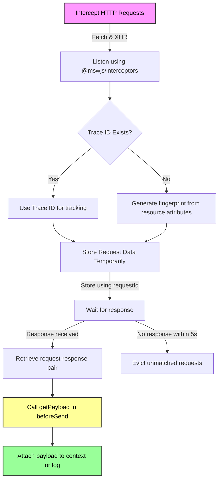

# **Datadog RUM Interceptor**

**A lightweight request/response interceptor for Datadog RUM, providing enhanced payload visibility for debugging and monitoring.**

## **Features**

- Intercepts Fetch & XHR requests
- Captures request & response payloads
- Seamlessly integrates with Datadog RUM
- Uses Trace ID if available, falls back to fingerprinting
- Automatically evicts unmatched requests after 5 seconds
- Users can modify the payload data as needed to remove or redact sensitive information.
  - [Sensitive Data Scanner](https://docs.datadoghq.com/sensitive_data_scanner/) can also be used for RUM events within Datadog.

---

## **Installation**

### **Install via NPM**

```bash
npm install @kyletaylored/datadog-rum-interceptor
```

### **Load via CDN**

For direct use in the **browser**:

```html
<script src="https://www.unpkg.com/@kyletaylored/datadog-rum-interceptor@latest/umd/main.js"></script>
```

---

## **Usage**

### **In a Browser**

```javascript
const DRI = window.DD_RUM_INTERCEPTOR.init({ debug: true });

window.DD_RUM.init({
  applicationId: "YOUR_APP_ID",
  clientToken: "YOUR_CLIENT_TOKEN",
  beforeSend: (event, context) => {
    if (
      event.type === "resource" &&
      ["xhr", "fetch"].includes(event.resource.type)
    ) {
      const payload = DRI.getPayload({ event, context });
      if (payload) {
        event.context.payload = payload;
      }
    }
    return true;
  },
});
```

---

### **In a Node.js Environment**

```javascript
import { init } from "@kyletaylored/datadog-rum-interceptor";
import { datadogRum } from '@datadog/browser-rum'

const DRI = init();

datadogRum.init({
  applicationId: '<DATADOG_APPLICATION_ID>',
  clientToken: '<DATADOG_CLIENT_TOKEN>',
  ...
  beforeSend: (event, context) => {
    if (event.type === 'resource' && ['xhr', 'fetch'].includes(event.resource.type)) {
      const payload = DRI.getPayload({ event, context });
      if (payload) {
        event.context.payload = payload;
      }
    }
    return true;
  },
})

```

---

## **How It Works**



1. **Intercepts HTTP requests**
   - Uses `@mswjs/interceptors` to listen for **Fetch & XHR requests**.
2. **Links Requests & Responses**
   - If **Trace ID exists**, it’s used for tracking.
   - If **Trace ID is missing**, a **fingerprint** is generated from resource attributes (best effort).
3. **Stores data temporarily**
   - **Request data is stored using `requestId`** until the response is received.
   - **Unmatched requests are automatically evicted after 5 seconds**.
4. **Retrieves payload in `beforeSend`**
   - The `getPayload({ event, context })` method **automatically** finds and attaches the payload.

---

## **API Reference**

### **`init(config: object)`**

Initializes the interceptor.

```javascript
const DRI = window.DD_RUM_INTERCEPTOR.init({ debug: true });
```

| Option  | Type   | Default | Description                  |
| ------- | ------ | ------- | ---------------------------- |
| `debug` | `bool` | `false` | Enable logging for debugging |

---

### **`getPayload({ event, context }): object | null`**

Retrieves the **request/response payload** for a given Datadog RUM event.

```javascript
const data = DRI.getPayload({ event, context });
console.log(data);
```

| Parameter   | Type             | Description                                        |
| ----------- | ---------------- | -------------------------------------------------- |
| `event`     | `object`         | The Datadog RUM event object.                      |
| `context`   | `object`         | The Datadog RUM context object.                    |
| **Returns** | `object \| null` | The extracted payload data or `null` if not found. |

---

### **`stop()`**

Stops the interceptor and cleans up resources.

```javascript
DRI.stop();
```

---

## **Troubleshooting**

### **No request data is being captured**

- Ensure **interceptor is initialized before Datadog RUM**.
- Verify `beforeSend` is correctly configured.

### **Requests with Trace ID are not matching**

- Check if Datadog **injects trace headers** (`x-datadog-trace-id`).
- If missing, the **fingerprinting fallback** will be used.

---

## **Disclaimer**

This software is provided "as is," without warranty of any kind, express or implied, including but not limited to the warranties of merchantability, fitness for a particular purpose, and non-infringement. In no event shall the authors, contributors, or their employers be liable for any claim, damages, or other liability, whether in an action of contract, tort, or otherwise, arising from, out of, or in connection with the software or the use or other dealings in the software.

By using this software, you acknowledge and agree that you assume all risks and liabilities associated with its use, and you waive any and all claims against the authors, contributors, and their employers.
